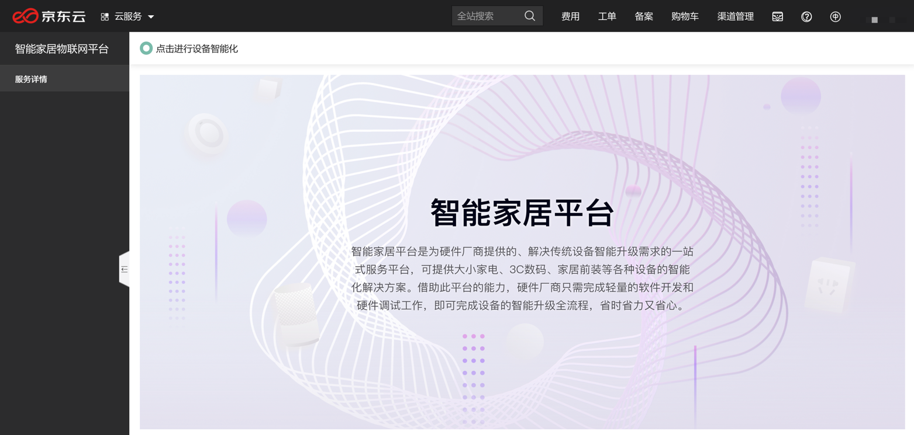
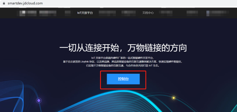

# 产品使用流程

## 第一步：账号实名认证
请确保您的京东云账号已经通过实名认证。 

## 第二步：登录控制台
入口1：产品介绍页
- 登录京东云官网（todo备注：此处可点击，域名为https://www.jdcloud.com/）
- 选择“产品>物联网>行业应用>智能家居平台”
- 在的产品介绍页面，点击“立即购买”，即可进入该服务控制台

入口2：控制台
- 登录京东云官网（todo备注：此处可点击，域名为https://www.jdcloud.com/）
- 选择“控制台”并登录，选择“产品>物联网>行业应用>智能家居平台”，即可进入到该服务控制台

## 第三步：点击进入智能家居平台
点击“点击进行设备智能化”或者“智能家居平台“图片即可开始进行设备智能化系统

## 第四步：点击控制台
进入设备智能化系统后，点击下方“控制台“入口即可开始设备智能化。Tips:点击下方页面所示”文档中心“，您可以看到设备智能化所有详细的文档。
